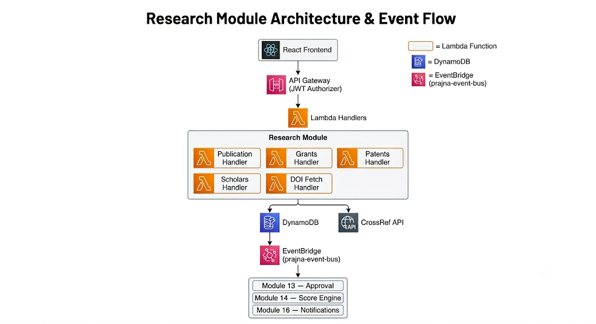

# [LLD] [Template] PRAJNA — Low-Level Design Document

## RESEARCH AND INNOVATION

**Version:** 1.0
**Date:** [04-06-2026]
**Author:** Abhigna Gajendra
**Reviewer:** Greeshmitha
**Status:** Draft | In Review | Approved

---

## Architecture Constraints (Read Before You Start)

All technology choices in your LLD **must** follow these project-wide constraints. These are non-negotiable unless you get explicit approval from the architect.

**Language & Libraries**

- TypeScript only — all libraries must be TypeScript-based or have TypeScript type definitions
- No exceptions without architect approval

**Infrastructure**

- AWS Serverless only — Lambda, API Gateway, DynamoDB, S3, Cognito, SQS, SNS, EventBridge, Step Functions, Aurora Serverless v2, Amazon Bedrock etc.
- No EC2, ECS, EKS, or self-managed servers
- Any exception requires written approval before including in your LLD

**CDK**

- All infrastructure must be defined using AWS CDK (TypeScript)
- Each module owns its own CDK stack

**If you believe your module needs something outside these constraints, raise it in Section 13 (Open Questions) with your justification. Do not assume approval.**

---

## 1. Module Overview:

**What does this module do?**

Module 9 — Research & Innovation manages the complete research portfolio of every GITAM faculty member. It handles four core areas: publications management with DOI auto-fetch, grants tracking, patents tracking, and PhD scholar management.

**Why does it exist in PRAJNA?**

Research output is a critical factor in faculty promotions, NAAC accreditation, and NIRF rankings. Without a centralized system, research data is scattered across emails, Excel sheets, and personal records. Module 9 provides a single source of truth for all faculty research activity, ensuring data is always accurate, approved, and report-ready.

**Who are the end users?**

- **Faculty** — submit and track their research activity
- **HoD** — review and approve research submissions from their department
- **Director** — approve high-impact SCI/Scopus publications
- **IQAC/Admin** — access research data for accreditation reports
- **PRAJNA Score Engine** — consumes approved research data for score calculation
- **Report Generator** — consumes research data for NAAC/NIRF reports

---

## 2. Scope

### **In Scope:**

- Publications management with DOI auto-fetch via CrossRef API
- Duplicate detection using DOI check and fingerprint hashing
- Side-by-side comparison UI for duplicate resolution
- Grants management with multiple investigator support
- Patents management with status tracking
- PhD Scholar management with stage tracking
- Multi-level approval workflow integration with Module 13
- EventBridge event publishing and subscription
- Campus-isolated data storage
- PDF proof document upload via Module 6 (File Storage)

**Out of Scope:**

- Approval workflow logic — handled by Module 13 (Approval Workflow Engine)
- Score recalculation — handled by Module 14 (PRAJNA Score Engine)
- Sending notifications — handled by Module 16 (Notification Engine)
- File storage and virus scanning — handled by Module 6 (File Storage)
- Report generation — handled by Module 17 (Report Generator)
- Audit trail logging — handled by Module 28 (Security & Audit Trail)

---

## 3. Dependencies

### **Depends On (modules this needs to work):**

- **Module 3 — Auth & User Management** — Cognito JWT token providing facultyId, campus, and role for every request
- **Module 4 — API Gateway & Middleware** — Shared API Gateway, Lambda authorizer, request validation, CORS
- **Module 5 — Database Layer** — DynamoDB table design, GSI configuration, SSM parameters
- **Module 6 — File Storage & Document Vault** — S3 pre-signed URLs for PDF proof upload before submission

**Depended By (modules that need this to work):**

- **Module 13 — Approval Workflow Engine** — receives approval requests from this module via POST /approval/start
- **Module 14 — PRAJNA Score Engine** — reads approved research data to calculate faculty PRAJNA score
- **Module 15 — Leaderboard** — consumes research scores for department and campus rankings
- **Module 16 — Notification Engine** — listens to EventBridge events fired by this module
- **Module 17 — Report Generator** — queries research data for NAAC, NIRF, NBA reports
- **Module 18 — APAR Workflow** — reads research output for annual appraisal calculation
- **AI Companion Modules** — reads research data for career coaching and morning briefings

---

## 4. Architecture & Design

### Component Diagram

### Data Flow

Step 1: Faculty enters DOI in React UI
Step 2: Frontend calls GET /research/publications/fetch-doi
Step 3: Lambda validates DOI format
Step 4: Lambda calls CrossRef API (5 sec timeout)
Step 5: CrossRef returns paper details
Step 6: Frontend auto-fills form
Step 7: Faculty uploads PDF → Module 6 returns S3 URL
Step 8: Faculty hits submit
Step 9: POST /research/publications called
Step 10: Lambda extracts facultyId + campus from JWT
Step 11: Lambda runs duplicate check
Step 12: If duplicate → return 409 + existing record
Step 13: If no duplicate → save to DynamoDB
with approvalStatus: "PENDING"
Step 14: Lambda calls POST /approval/start
workflowType: RESEARCH_HIGH_IMPACT or STANDARD
Step 15: Store returned approvalRequestId
Step 16: Fire EventBridge event "publication.submitted"
Step 17: Return 201 success response to frontend

Step 18: Later — ApprovalFinalized event received
Step 19: Lambda updates approvalStatus in DynamoDB
Step 20: If approved → Score Engine triggered automatically

Folder Structure:

src/modules/research/
├── handlers/
│   ├── publication.handler.ts
│   ├── grant.handler.ts
│   ├── patent.handler.ts
│   ├── scholar.handler.ts
│   └── doi-fetch.handler.ts
├── services/
│   ├── publication.service.ts
│   ├── grant.service.ts
│   ├── patent.service.ts
│   ├── scholar.service.ts
│   └── doi-fetch.service.ts
├── adapters/
│   ├── crossref.adapter.ts
│   └── dynamodb.adapter.ts
├── validators/
│   ├── publication.validator.ts
│   └── doi.validator.ts
├── models/
│   ├── publication.model.ts
│   ├── grant.model.ts
│   ├── patent.model.ts
│   └── scholar.model.ts
├── interfaces/
│   ├── publication.interface.ts
│   └── approval.interface.ts
├── types/
│   └── research.types.ts
└── **tests**/
├── publication.test.ts
├── grant.test.ts
├── patent.test.ts
└── scholar.test.ts

---

## 5. Data Model

### Table Name: prajna-research

Publications:
PK = CAMPUS#<campus>
SK = PUB#<year>#FACULTY#<facultyId>#<publicationId>
entityType = "PUBLICATION"

Grants:
PK = CAMPUS#<campus>
SK = GRANT#FACULTY#<facultyId>#<grantId>
entityType = "GRANT"

Patents:
PK = CAMPUS#<campus>
SK = PATENT#FACULTY#<facultyId>#<patentId>
entityType = "PATENT"

Scholars:
PK = CAMPUS#<campus>
SK = SCHOLAR#FACULTY#<facultyId>#<scholarId>
entityType = "SCHOLAR"

Publication Authors:
PK = PUB#<publicationId>
SK = AUTHOR#<authorOrder>
entityType = "PUBLICATION_AUTHOR"

Grant Investigators:
PK = GRANT#<grantId>
SK = INVESTIGATOR#<facultyId>
entityType = "GRANT_INVESTIGATOR"

GSIs needed:

GSI1:

- GSI1PK = facultyId
- GSI1SK = entityType
- Purpose: get all records for a faculty member

GSI2:

- GSI2PK = approvalStatus
- GSI2SK = campus
- Purpose: get all pending approvals

GSI3:

- GSI3PK = fingerprintHash
- Purpose: duplicate detection

**Access Patterns:**

1. Get all publications for a faculty member
→ Query PK=CAMPUS#<campus>
→ SK begins_with PUB#
→ Filter entityType = "PUBLICATION"
2. Get all grants for a faculty member
→ Query PK=CAMPUS#<campus>
→ SK begins_with GRANT#FACULTY#<facultyId>
→ Filter entityType = "GRANT"
3. Get all patents for a faculty member
→ Query PK=CAMPUS#<campus>
→ SK begins_with PATENT#FACULTY#<facultyId>
→ Filter entityType = "PATENT"
4. Get all scholars for a faculty member
→ Query PK=CAMPUS#<campus>
→ SK begins_with SCHOLAR#FACULTY#<facultyId>
→ Filter entityType = "SCHOLAR"
5. Get all records for a faculty (any type)
→ GSI1 Query GSI1PK=<facultyId>
6. Get all pending approvals
→ GSI2 Query GSI2PK=PENDING
→ Filter campus if needed
7. Duplicate detection by DOI/hash
→ GSI3 Query GSI3PK=<fingerprintHash>
8. Get authors for a publication
→ Query PK=PUB#<publicationId>
→ SK begins_with AUTHOR#
9. Get investigators for a grant
→ Query PK=GRANT#<grantId>
→ SK begins_with INVESTIGATOR#
10. Get publications by year
→ Query PK=CAMPUS#<campus>
→ SK begins_with PUB#<year>

## 6. API Design

**Endpoints Table:**

| Method | Endpoint | Description | Auth Required | Request Body | Response |
| --- | --- | --- | --- | --- | --- |
| GET | /research/publications/fetch-doi | Fetch paper details from CrossRef | Yes | ?doi=10.1234/example | 200 paper details |
| POST | /research/publications/check-duplicate | Check if publication already exists | Yes | title, authors, year, doi | 200 isDuplicate / 409 duplicate found |
| POST | /research/publications | Submit new publication | Yes | doi, title, authors, year, journalName, publicationType, proofDocumentUrl | 201 publicationId, approvalStatus |
| GET | /research/publications | Get all my publications | Yes | None | 200 array of publications |
| GET | /research/publications/{id} | Get one publication | Yes | None | 200 publication details |
| PUT | /research/publications/{id} | Update publication | Yes | fields to update | 200 success message |
| DELETE | /research/publications/{id} | Soft delete publication | Yes | None | 200 success message |
| POST | /research/grants | Add new grant | Yes | projectTitle, fundingAgency, amount, dates, investigators | 201 grantId |
| GET | /research/grants | Get all my grants | Yes | None | 200 array of grants |
| GET | /research/grants/{id} | Get one grant | Yes | None | 200 grant details |
| PUT | /research/grants/{id} | Update grant | Yes | fields to update | 200 success |
| DELETE | /research/grants/{id} | Soft delete grant | Yes | None | 200 success |
| POST | /research/patents | Add new patent | Yes | patentTitle, applicationNumber, filingDate, country, patentStatus | 201 patentId |
| GET | /research/patents | Get all my patents | Yes | None | 200 array of patents |
| GET | /research/patents/{id} | Get one patent | Yes | None | 200 patent details |
| PUT | /research/patents/{id} | Update patent | Yes | fields to update | 200 success |
| DELETE | /research/patents/{id} | Soft delete patent | Yes | None | 200 success |
| POST | /research/scholars | Add PhD scholar | Yes | scholarName, email, topic, enrollmentYear, stage | 201 scholarId |
| GET | /research/scholars | Get all my scholars | Yes | None | 200 array of scholars |
| GET | /research/scholars/{id} | Get one scholar | Yes | None | 200 scholar details |
| PUT | /research/scholars/{id} | Update scholar | Yes | fields to update | 200 success |
| DELETE | /research/scholars/{id} | Soft delete scholar | Yes | None | 200 success |

---

**Error Handling:**

`400 INVALID_PAYLOAD      → Missing or invalid fields
400 INVALID_DOI_FORMAT   → DOI format is wrong
403 FORBIDDEN            → Not authorized for this action
404 NOT_FOUND            → Record doesn't exist
409 DUPLICATE_FOUND      → Duplicate publication detected
500 INTERNAL_ERROR       → Unexpected failure
503 SERVICE_UNAVAILABLE  → CrossRef API is down

Standard Error Response Format:
{
  "statusCode": 400,
  "error": "INVALID_PAYLOAD",
  "message": "Missing required field: title",
  "requestId": "uuid"
}`

---

## 7. Technology Choices

| Area | Choice | Why | Alternatives Considered |
| --- | --- | --- | --- |
| Language | TypeScript | Single language across frontend, backend and CDK. Type safety catches errors at compile time not runtime. Mandatory per project constraints. | JavaScript — rejected because no type safety |
| Infrastructure | AWS Serverless (Lambda, API Gateway) | Zero server management, auto-scaling, pay per use. Each module deploys independently. | EC2/ECS — rejected per architecture constraints. No self managed servers allowed. |
| Database | DynamoDB | Serverless, auto-scaling, pay per request. Data retrieved efficiently using partition keys with campus isolation built into key design. | Aurora SQL — rejected because research data does not need complex joins. DynamoDB fits the access patterns. |
| File Storage | S3 | PDFs are large files. Storing in DynamoDB wastes space and slows queries. S3 stores the file, DynamoDB stores only the reference URL. | DynamoDB — rejected because not designed for large file storage |
| Event Communication | EventBridge (prajna-event-bus) | Loose coupling between modules. Research module fires one event and moves on. Other modules listen independently. If one module fails others still work. | Direct Lambda calls — rejected because creates tight coupling and cascading failures |
| DOI Fetch | CrossRef API | Free, widely used global academic database. Returns structured paper metadata using DOI. No API key required for basic usage. | Scopus API — can be used as fallback but requires institutional API key |
| Config Management | SSM Parameter Store | Config changes without code redeployment. API URLs and secrets never appear in codebase or Git history. | Hardcoded values — rejected because requires redeployment on every config change |
| IaC | AWS CDK (TypeScript) | TypeScript native. Each module owns its own CDK stack. Reusable constructs. One language everywhere. | CloudFormation — rejected because CDK is mandatory per project constraints |
| Auth | AWS Cognito + JWT | Serverless, integrates natively with API Gateway. JWT token carries facultyId, campus and role securely. Faculty cannot fake their own identity. | Custom auth — rejected because Cognito is mandatory per project constraints |
| Duplicate Detection | DOI check + Fingerprint Hashing | DOI check is fastest and most reliable for published papers. Fingerprint hash handles papers without DOI by normalizing and hashing title + authors + year. | Title string matching — rejected because unreliable due to typos and formatting differences |

---

## 8. Security Considerations

**Authentication:**

- `Every API endpoint requires a valid JWT token
JWT token is issued by AWS Cognito on login
API Gateway validates JWT before
 request reaches Lambda
If token is invalid or expired →
 401 Unauthorized returned immediately
Lambda never processes unauthenticated requests`

---

**Authorization:**

- `facultyId and campus always extracted
 from JWT token — never trusted from
 request body
Role based access:
 Faculty → can only view and edit their own data
 HoD → can approve/reject their department data
 Director → can approve SCI/Scopus publications
 Admin → read access across all campuses
If faculty tries to access another
 faculty's data → 403 Forbidden`

---

**Campus Isolation:**

- `All DynamoDB partition keys begin with
 CAMPUS#<campus>
Campus value always comes from JWT token:
 event.requestContext.authorizer
 .claims["custom:campus"]
A Bengaluru faculty member physically
 cannot reach Hyderabad data because
 partition keys don't match
Never trust campus from request payload`

---

**Input Validation:**

- `All requests validated before processing:
 → Required fields must be present
 → publicationType must be SCI/SCOPUS/CONFERENCE
 → DOI format validated before CrossRef call
 → proofDocumentUrl must be valid S3 URL
 → year must be valid number
 → File type must be PDF only
 → File size limit enforced by Module 6
Invalid requests rejected with
 400 INVALID_PAYLOAD immediately
No external API calls made on invalid input`

---

**Sensitive Data Handling:**

- `CrossRef API URL stored in SSM
 Parameter Store — never hardcoded
No secrets or API keys in codebase
 or Git history
All data encrypted at rest
 (AWS managed keys)
All data encrypted in transit (TLS 1.3)
PDF proof documents stored in S3 with
 private access — accessed only via
 pre-signed URLs from Module 6`

---

**Audit Trail:**

- `Every record contains:
 createdAt, updatedAt, createdBy, updatedBy
Every data change tracked via
 DynamoDB Streams
Audit logging handled by
 Module 28 — Security & Audit Trail
Immutable audit trail for all
 approval status changes`

---

**Privacy Controls:**

- `Faculty can only see their own
 research data
HoD can see department data only
Research data is not visible to
 other faculty members
AI Companion conversations are
 private per HLD specification`

---

## 9. Testing Strategy

| Type | What You'll Test | Tool/Approach |
| --- | --- | --- |
| Unit | DOI format validation function | Jest |
| Unit | Fingerprint hash generation | Jest |
| Unit | Text normalization function (lowercase, trim, remove special chars) | Jest |
| Unit | Approval status transition logic | Jest |
| Unit | Campus extraction from JWT token | Jest |
| Unit | Duplicate detection logic (DOI check + hash check) | Jest |
| Integration | POST /research/publications full flow — submit, duplicate check, save to DynamoDB, call approval start | Jest + AWS SDK |
| Integration | GET /research/publications/fetch-doi — validate DOI, call CrossRef, return paper details | Jest + mock CrossRef |
| Integration | CrossRef timeout handling — verify 503 returned after 5 seconds | Jest + mock timeout |
| Integration | Duplicate detection — submit same paper twice, verify 409 returned | Jest + DynamoDB local |
| Integration | Campus isolation — verify Bengaluru faculty cannot access Hyderabad data | Jest + AWS SDK |
| Event Contract | publication.submitted event fires correctly after submission | Jest + EventBridge mock |
| Event Contract | ApprovalFinalized event received and approvalStatus updated in DynamoDB | Jest + EventBridge mock |
| Event Contract | RESEARCH_HIGH_IMPACT workflowType sent correctly for SCI/Scopus publications | Jest + Module 13 mock |
| E2E | Faculty submits SCI publication → approval workflow starts → Director approves → Score Engine triggered | Postman / AWS Console |
| E2E | Faculty submits paper with existing DOI → duplicate warning shown → side by side comparison displayed | Postman |
| E2E | CrossRef API down → faculty falls back to manual entry → submission succeeds | Postman |
| E2E | Faculty resubmits after rejection → status returns to PENDING → HoD notified | Postman |

**Coverage Target: minimum 80%**

---

## 10. CDK / Infrastructure

**AWS Resources This Module Needs:**

`1. Lambda Functions (5):
   - research-publication-handler
   - research-grant-handler
   - research-patent-handler
   - research-scholar-handler
   - research-doi-fetch-handler

2. API Gateway:
   - Routes for all endpoints
   - JWT Authorizer (from Module 4)
   - CORS configuration

3. DynamoDB Tables (4):
   - research-publications
   - research-publication-authors
   - research-grants
   - research-grant-investigators
   - research-patents
   - research-scholars
   
   GSIs Required:
   - approvalStatus-index 
     (query all pending approvals)
   - facultyId-index 
     (query all records by faculty)
   - fingerprintHash-index 
     (duplicate detection)

4. EventBridge:
   - Bus: prajna-event-bus
   - Rule: subscribe to ApprovalFinalized
   - Filter: detail.moduleId = 'research'

5. SSM Parameter Store:
   - /prajna/research/crossref-api-url
   - /prajna/research/timeout-ms

6. IAM Roles:
   - research-lambda-role
   - Permissions:
     → DynamoDB read/write on research tables
     → EventBridge publish to prajna-event-bus
     → SSM read parameters
     → S3 read proof documents
     → CloudWatch logs write`

---

**CDK Stack Design:**

typescript

`// Stack: ResearchModuleStack

export class ResearchModuleStack extends Stack {
  constructor(scope: Construct, id: string) {
    
    // 1. DynamoDB Tables
    const publicationsTable = new Table(
      this, 'ResearchPublications', {
      tableName: 'research-publications',
      partitionKey: { 
        name: 'PK', type: AttributeType.STRING 
      },
      sortKey: { 
        name: 'SK', type: AttributeType.STRING 
      },
      billingMode: BillingMode.PAY_PER_REQUEST
    });

    // GSI for approval queries
    publicationsTable.addGlobalSecondaryIndex({
      indexName: 'approvalStatus-index',
      partitionKey: { 
        name: 'approvalStatus', 
        type: AttributeType.STRING 
      }
    });

    // 2. Lambda Functions
    const publicationHandler = new Function(
      this, 'PublicationHandler', {
      functionName: 'research-publication-handler',
      runtime: Runtime.NODEJS_18_X,
      handler: 'publication.handler',
      code: Code.fromAsset('src/modules/research'),
      environment: {
        TABLE_NAME: publicationsTable.tableName,
        CROSSREF_URL_PARAM: 
          '/prajna/research/crossref-api-url'
      }
    });

    // 3. Grant Lambda permissions
    publicationsTable.grantReadWriteData(
      publicationHandler
    );

    // 4. EventBridge Rule
    const rule = new Rule(
      this, 'ApprovalFinalizedRule', {
      eventBus: EventBus.fromEventBusName(
        this, 'PrajnaEventBus', 
        'prajna-event-bus'
      ),
      eventPattern: {
        detailType: ['ApprovalFinalized'],
        source: ['prajna.approval'],
        detail: {
          moduleId: ['research']
        }
      }
    });

    // 5. SSM Parameters
    new StringParameter(
      this, 'CrossRefApiUrl', {
      parameterName: 
        '/prajna/research/crossref-api-url',
      stringValue: 
        'https://api.crossref.org/works/'
    });
  }
}`

---

**How This Stack Connects To Other Stacks:**

`Depends on:
- Module 4 stack → imports API Gateway ID
- Module 5 stack → imports DynamoDB config
- Module 19 stack → imports prajna-event-bus ARN`

SSM Parameters exported for other stacks:

- /prajna/research/publications-table-arn
- /prajna/research/lambda-role-arn
- /prajna/research/api-endpoint

---

## 11. Risks & Mitigation

| Risk | Impact | Mitigation |
| --- | --- | --- |
| CrossRef API is down or unavailable | Faculty cannot auto-fetch paper details. Submissions blocked if only DOI entry is supported. | Allow manual entry of all paper fields as fallback when CrossRef is unavailable. Show clear error message with manual entry option. |
| Race condition — two faculty submit same paper simultaneously, both pass duplicate check before either saves | Duplicate records created in DynamoDB despite duplicate detection logic | Use DOI as part of DynamoDB sort key. Database level uniqueness prevents duplicate records even under concurrent submissions. For papers without DOI use fingerprintHash as part of sort key. |
| CrossRef returns incorrect or incomplete paper details | Faculty submits wrong data unknowingly. Affects NAAC reports and PRAJNA score accuracy. | Allow faculty to review and edit all auto-fetched details before final submission. Faculty confirms data before hitting submit. |
| Faculty submits fake or low quality journal as SCI/Scopus | Inflated PRAJNA score. Inaccurate accreditation data. | HoD and Director approval required for SCI/Scopus publications. Proof document upload mandatory. Multi-level human verification before approval. |
| Inconsistent event payloads to EventBridge | Integration failures with Module 13, 14, 16 | Shared event schema validation. Event contracts tested before deployment. Follow prajna-event-bus standards from Module 19. |
| Module 13 Approval Engine is down when research module tries to start workflow | Publication saved but approval workflow never starts. Record stuck in PENDING forever. | Store approvalRequestId. Implement retry logic when calling POST /approval/start. Alert via CloudWatch alarm if approval start fails. |
| Large PDF proof uploads slow down submission | Poor faculty experience. Lambda timeout on large files. | PDF upload handled separately by Module 6 before submission. Research module only stores S3 URL reference. Lambda never handles file directly. |
| Breaking changes in dependent module APIs | Integration failures across Faculty Data modules | Communicate all API contract changes to dependent modules before implementation. Follow strategy doc API dependency management rules. |

---

## 12. Milestones & Timeline

| Week | Deliverable |
| --- | --- |
| Week 1–2 | LLD complete and approved. All data models, API contracts, event schemas, and architecture decisions finalized and reviewed by mentor. |
| Week 3–4 | CDK stack scaffolded. DynamoDB tables created with correct partition keys and GSIs. Lambda functions created with basic handlers. Module folder structure set up. SSM parameters configured. |
| Week 5–6 | Core publication APIs implemented. DOI fetch with CrossRef integration working. Duplicate detection logic implemented. POST /research/publications complete with approval workflow integration (Module 13). |
| Week 7–8 | Grants, Patents and PhD Scholar APIs implemented. EventBridge integration complete. ApprovalFinalized event subscription working. All approval status updates functioning correctly. |
| Week 9–10 | Unit tests and integration tests written. All APIs tested end to end. Campus isolation verified. CrossRef timeout and error handling tested. Bug fixes completed. |
| Week 11–12 | UAT with faculty and HoDs. Final bug fixes. Documentation completed. README finalized. Module deployed to staging environment and ready for go-live. |

---

## 13. Open Questions

1. CrossRef API Rate Limits
Should we implement request throttling or caching for CrossRef API calls to avoid hitting rate limits during peak usage? What is the acceptable rate limit threshold?
2. Scopus API Integration
The HLD mentions both CrossRef and Scopus for DOI auto-fetch. Should this module integrate both APIs? If CrossRef fails, should Scopus be used as fallback? Requires institutional Scopus API key from GITAM.
3. Duplicate Detection Threshold
For papers without DOI, fingerprint hash uses exact match after normalization. Should we implement fuzzy matching with a similarity threshold (e.g. 80% match = possible duplicate)? What threshold is acceptable?
4. Historical Data Migration
How should existing faculty publications be imported into Module 9? Will Module 30 (Data Migration Tools) provide Excel templates for bulk import of historical research data?
5. External Author Validation
For co-authors outside GITAM marked as isExternal: true — should any validation be done on their details? Or is free text entry acceptable?
6. Patent Application Number Format
Should patent application numbers be validated against a specific format? Different countries have different formats. Should we validate per country?
7. PhD Scholar Email Domain
Should scholarEmail be restricted to GITAM email domain only? Or can external PhD scholars have non-GITAM emails?
8. Grant Amount Currency
Should sanctionedAmount always be in Indian Rupees (INR)? Or should we support multiple currencies for international grants?
9. Approval Workflow for Grants and Patents
The guide specifies STANDARD workflow for most entities. Should grants above a certain amount threshold use a different workflow type with additional approval levels?
10. Score Engine Read Pattern
What specific fields does Module 14 (PRAJNA Score Engine) need to read from research data? Need to confirm read access patterns and GSI requirements with Module 14 owner.

---

## 14. Self-Assessment — Amazon Leadership Principles

Review all 14 LPs below. Pick your **top 3 you demonstrated** and **top 3 you need to work on**. Provide an example for each.

| # | Leadership Principle | Demonstrated / Need to Work On | Example from Your Work |
| --- | --- | --- | --- |
| 1 | **Customer Obsession** — Who is your module's customer? How did you design for them? | Demonstrated | Designed soft duplicate detection instead of hard block — protecting faculty from losing genuine paper submissions. Connected timestamps to AI Companion behavior to encourage faculty who give up after rejection. |
| 2 | **Ownership** — How did you take end-to-end ownership of your module? | Need to Work On | Need to take deeper ownership of understanding every architectural decision independently — being able to explain and defend each design choice without guidance during mentor review. |
| 3 | **Invent and Simplify** — Where did you simplify a complex problem? |  Demonstrated | Simplified duplicate detection into two clear strategies — DOI check for published papers and fingerprint hashing for papers without DOI. Avoided complex ML similarity matching in favor of simple normalization and hashing. |
| 4 | **Are Right, A Lot** — What decision did you make with incomplete information? How did it turn out? |  Need to Work On | Initially suggested temporary DOI for papers without DOI which would have created more duplicates. Also suggested fixed columns for Co-Investigators which breaks with multiple Co-PIs. Needed guidance to course correct both decisions. |
| 5 | **Learn and Be Curious** — What new technology/concept did you learn for this module? | Demonstrated | Came in with zero knowledge of research domain, DOI, CrossRef, async/await, DynamoDB key design and EventBridge. Asked "can you explain this from business perspective first" showing genuine curiosity.  |
| 6 | **Hire and Develop the Best** — How did you help a teammate or learn from one? | Need to Work On | Limited opportunity observed in this session. Going forward — share knowledge gained here with Faculty Data team members working on related modules. |
| 7 | **Insist on the Highest Standards** — Where did you refuse to cut corners? | Demonstrated | Refused to skip understanding and asked for business context before jumping into design. Asked for proper explanation of grants, patents and PhD scholars before attempting data model design. Did not guess blindly. |
| 8 | **Think Big** — How does your module scale or support PRAJNA's long-term vision? | Demonstrated | Connected Module 9 design to downstream impact on NAAC reports, PRAJNA Score Engine, AI Companion and leaderboards. Understood that research data quality directly affects entire PRAJNA platform quality. |
| 9 | **Bias for Action** — Where did you make a quick decision instead of over-analyzing? | Demonstrated | When you didn't know something you took a guess and kept moving instead of freezing. Covered all 13 LLD sections in one day despite starting with zero domain knowledge. |
| 10 | **Frugality** — How did you achieve more with less? | Demonstrated | Chose to validate DOI format before calling CrossRef API — avoiding unnecessary external API calls on invalid input. Stored only S3 URL reference in DynamoDB instead of storing PDF directly — saving storage cost. |
| 11 | **Earn Trust** — How did you handle disagreements or build trust with your team? | Demonstrated | Consistently said "I don't know" honestly instead of guessing incorrectly. Asked for business context before design. This honesty allowed the session to be productive and built a trustworthy LLD. |
| 12 | **Dive Deep** — Where did you dig into the details to find the right solution? |  Need to Work On | Several times stopped at surface level answers without reasoning further. For example — knew async/await was about waiting but could not reason what happens without it. Need to push reasoning one level deeper before asking for help. |
| 13 | **Have Backbone; Disagree and Commit** — Did you push back on a decision? How? | Demonstrated | Pushed back when confused — asked "what is the need for faculty to enter all details again if DOI fetches everything?" That challenge led to the two scenario design which is a core part of the module. |
| 14 | **Deliver Results** — Did you meet your milestones? What did you ship? | Demonstrated | Starting with zero domain knowledge of research publications, grants, patents and PhD scholars — completed a full 13 section LLD covering data models, API design, async flows, security, testing and infrastructure within given timeline. |

**Top 3 I Demonstrated:**

1. **Learn and Be Curious** — Started with zero domain knowledge and learned DOI, CrossRef, async/await, DynamoDB design and EventBridge from scratch to complete a full LLD in one day.
2. **Customer Obsession** — Chose soft duplicate detection over hard blocking to protect faculty from losing genuine paper submissions.
3. **Bias for Action** — Covered all 13 LLD sections in one day despite starting with zero domain knowledge and a tight deadline.

---

**Top 3 I Need to Work On:**

1. **Are Right, A Lot** — Need to think one level deeper before committing to a design decision.
2. **Dive Deep** — Need to reason from existing knowledge further before asking for help.
3. **Ownership** — Need to be able to explain and defend every architectural decision independently without guidance.

---

## 15. References

| **#** | **Reference** | **Link** |
| --- | --- | --- |
| 1 | PRAJNA HLD — High Level Design Document v1.0 | Internal Document |
| 2 | PRAJNA Faculty Data Modules LLD Guide (Modules 7–12) | Internal Document |
| 3 | Faculty Data Module Strategy Document | Internal Document |
| 4 | LLD Template — PRAJNA Low Level Design Document | Internal Document |
| 5 | CrossRef API Documentation | [https://api.crossref.org](https://api.crossref.org/) |
| 6 | AWS DynamoDB Developer Guide | [https://docs.aws.amazon.com/dynamodb](https://docs.aws.amazon.com/dynamodb) |
| 7 | AWS Lambda Developer Guide | [https://docs.aws.amazon.com/lambda](https://docs.aws.amazon.com/lambda) |
| 8 | AWS EventBridge Developer Guide | [https://docs.aws.amazon.com/eventbridge](https://docs.aws.amazon.com/eventbridge) |
| 9 | AWS CDK Developer Guide | [https://docs.aws.amazon.com/cdk](https://docs.aws.amazon.com/cdk) |
| 10 | AWS Cognito Developer Guide | [https://docs.aws.amazon.com/cognito](https://docs.aws.amazon.com/cognito) |

---

*PRAJNA — प्रज्ञा | Super-30*